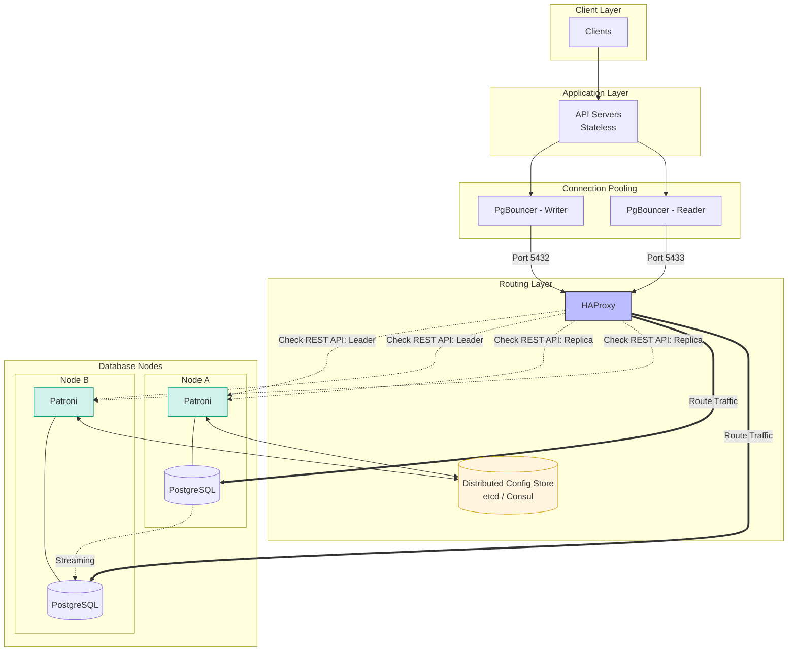

# Smart Catalog V2

This is an implementation of the smart catalog that includes smart matchmaking engine.
The vision of this system is a read-heavy, zero-latency platform that would need to maintain data integrity and availability no matter that demand.

---
## The Data Layer

After reading how OpenAI was able to create a resilient and highly available system, I decided to take inspiration from their setup.
A normalized DB structure is good for data integrity and low storage footprint but with the cost of expensive joins that would suffocate the system in peak times.
I figured, a constellation where the system can enjoy best of both worlds (Hannah Montana much...), would be the best.
So I picked the following Topology for the backbone of the application - the Data Layer:




This architecture is works well with Django’s connection-per-process model. By using PgBouncer, we will multiplex hundreds of Django worker connections into a small, efficient pool, preventing our API scale-outs from exhausting PostgreSQL's max_connections.

The HAProxy and Patroni duo ensures the application remains topology-unaware: Django simply points to two static endpoints (Writer/Reader), while HAProxy uses Patroni’s REST API to dynamically route traffic to the correct nodes. This allows us to use Django’s Database Routers to split traffic with total confidence that failovers will be handled transparently, requiring zero configuration changes in our `settings.py` during a database promotion.


### Let's talk tables

The following tables have been used in V1 to ensure:
- integrity
- reduced memory footprint
- normalization


```sql
  CREATE TABLE IF NOT EXISTS brands
(
    id bigint NOT NULL GENERATED BY DEFAULT AS IDENTITY,
    created_at timestamp(6) with time zone NOT NULL,
    name character varying(30) NOT NULL,
    CONSTRAINT brands_pkey PRIMARY KEY (id),
    CONSTRAINT ukoce3937d2f4mpfqrycbr0l93m UNIQUE (name)
)
CREATE TABLE IF NOT EXISTS categories
(
    id bigint NOT NULL GENERATED BY DEFAULT AS IDENTITY,
    created_at timestamp(6) with time zone NOT NULL,
    name character varying(255) NOT NULL,
    public_id uuid NOT NULL,
    CONSTRAINT categories_pkey PRIMARY KEY (id),
    CONSTRAINT ukt8o6pivur7nn124jehx7cygw5 UNIQUE (name),
    CONSTRAINT uktixg3o82o9692kj90tgv77nsp UNIQUE (public_id)
)
CREATE TABLE IF NOT EXISTS product
(
    id bigint NOT NULL GENERATED BY DEFAULT AS IDENTITY,
    created_at timestamp(6) with time zone NOT NULL,
    image_url text,
    price numeric(12,2),
    product_url text,
    public_id uuid NOT NULL,
    tier character varying(255) NOT NULL,
    title text,
    brand_id bigint NOT NULL,
    CONSTRAINT product_pkey PRIMARY KEY (id),
    CONSTRAINT ukek2q3roswqf1aevyk830g9qb0 UNIQUE (public_id),
    CONSTRAINT fkh259gmj2fw5b2pqed7ii3rpnl FOREIGN KEY (brand_id)
        REFERENCES brands (id) MATCH SIMPLE
        ON UPDATE CASCADE
        ON DELETE CASCADE,
    CONSTRAINT product_tier_check CHECK (tier::text = ANY (ARRAY['BUDGET'::character varying, 'MID'::character varying, 'PREMIUM'::character varying]::text[]))
)
```
A join table `product_categories` enables the many-to-many relationship between products and categories.

With the new requirement to use `pgvector` (we will use `pgvectorscale` to move the memory burden from RAM to the disk to cut costs of the absurd amount of memory required for indexing),
And the aspiration to keep the benefits of normalized data model, we will introduce the following search table:

```sql
CREATE TABLE product_search (
    product_id bigint PRIMARY KEY,
    embedding vector(1536),

    brand_id bigint,
    brand_name text,

    tier varchar(20),
    price numeric(12,2),

    category_ids bigint[],

    // ... perhaps other attributes which
    // could come handy later on
);
```

and the following indexes

```sql
CREATE INDEX ON product_search
USING hnsw (embedding vector_cosine_ops);

CREATE INDEX ON product_search (tier);
CREATE INDEX ON product_search (brand_id);
CREATE INDEX ON product_search USING gin (category_ids);
```

Each index serves us in a different aspect:
- index on `embedding`: to accelerate similarity search and retrieve top N nearest neighbors (the similarity metric should be reconsidered with actual data).
- indexes on `tier` and `brand_id` to allow filtering based on those criterias
- index on `category_ids` to allow fast multivalue filtering by selected categories

(is it "indexes" or "indices"...?)

