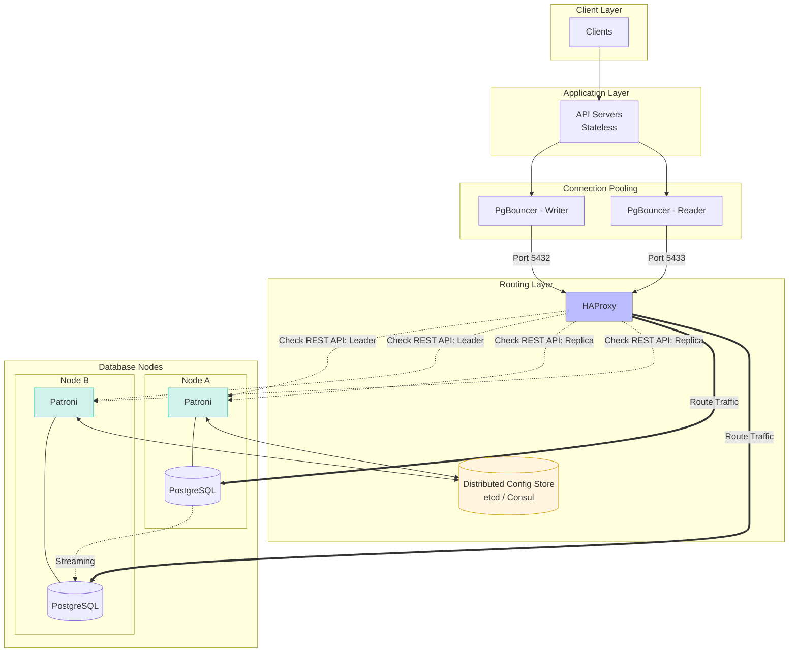

# Topology

```mermaid
graph TD
    subgraph Clients_Layer [Client Layer]
        Clients[Clients]
    end

    subgraph App_Layer [Application Layer]
        API[API Servers<br/>Stateless]
    end

    subgraph Pooling_Layer [Connection Pooling]
        PB_Write[PgBouncer - Writer]
        PB_Read[PgBouncer - Reader]
    end

    subgraph LB_Layer [Routing Layer]
        HA[HAProxy]
        DCS[(Distributed Config Store<br/>etcd / Consul)]
    end

    subgraph DB_Nodes [Database Nodes]
        subgraph Node_1 [Node A]
            P1[Patroni]
            DB1[(PostgreSQL)]
        end
        subgraph Node_2 [Node B]
            P2[Patroni]
            DB2[(PostgreSQL)]
        end
    end

    %% Flow
    Clients --> API
    API --> PB_Write
    API --> PB_Read

    PB_Write -->|Port 5432| HA
    PB_Read -->|Port 5433| HA

    %% Health Checks & Routing
    HA -.->|Check REST API: Leader| P1
    HA -.->|Check REST API: Leader| P2
    HA -.->|Check REST API: Replica| P1
    HA -.->|Check REST API: Replica| P2

    HA ===>|Route Traffic| DB1
    HA ===>|Route Traffic| DB2

    %% Patroni Management
    P1 --- DB1
    P2 --- DB2
    P1 <--> DCS
    P2 <--> DCS
    
    %% Replication
    DB1 -.->|Streaming| DB2

    %% Styling
    style DCS fill:#fff4dd,stroke:#d4a017
    style P1 fill:#d1f2eb,stroke:#16a085
    style P2 fill:#d1f2eb,stroke:#16a085
    style HA fill:#bbf,stroke:#333
```

# Application Architectrue

